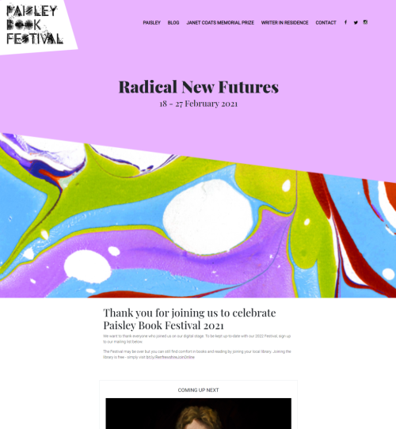
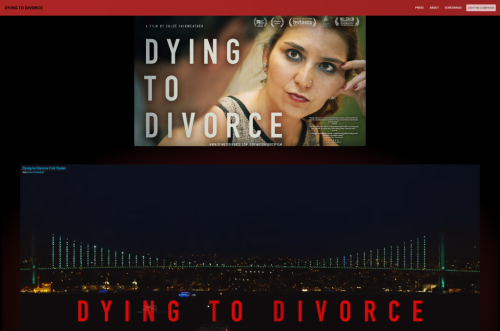

# [Paisley Book Festival](https://paisleybookfest.com/)

Site design, implementation, and administration for a Scottish literary festival. Written in Python/Django.

# [Dying to Divorce](https://dyingtodivorce.com/)

Site design and administration for a documentary film about domestic violence in Turkey. Static site generated with Gulp/NPM, with custom Python extensions for dynamic content generation

